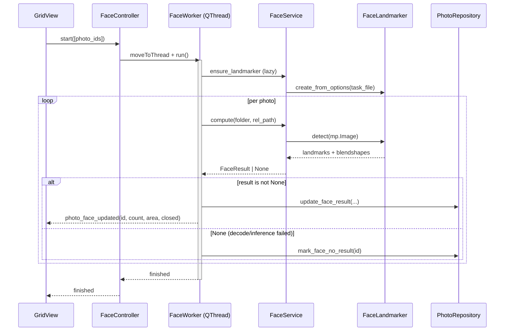

# Face Detection MVP — Design Spec

**Date:** 2026-05-14
**Scope:** Phase 2 — face count + max face area + eye-closed detection, no face recognition.

## Goal

Give the user three new culling signals derived from MediaPipe FaceLandmarker:

1. **Has face / No face** — quick triage filter for "portraits" vs "non-portraits".
2. **Eyes closed** — surface group portraits where at least one subject blinked.
3. **Max face area** — implicit (stored, not surfaced in UI yet) tie-breaker for future sort-by-face-size.

Out of scope for this MVP: face identity (InsightFace), face crops, face bounding-box overlay on Loupe, per-subject eye state.

## API choice

MediaPipe Tasks API ships three face options:

| API | Output | Speed | Notes |
|-----|--------|-------|-------|
| `FaceDetector` (BlazeFace) | bbox + 6 keypoints | ~5 ms / frame | no blendshapes, no landmark detail |
| `FaceLandmarker` | 478 3D landmarks + 52 blendshapes | ~30-50 ms / frame | what we need for `eyeBlinkLeft/Right` |
| Legacy `mp.solutions.face_mesh` | similar landmarks | similar | deprecated |

We pick **FaceLandmarker** because blendshape output is the only built-in way to
detect closed eyes without writing a custom EAR (Eye Aspect Ratio) classifier
over raw landmarks. 30-50 ms / frame is acceptable for batched analysis behind a
manual button trigger.

Configuration:

- `output_face_blendshapes = True`
- `num_faces = 10` (group portraits routinely have 5-10)
- Long-edge resize to 1024 px before detection (no measurable accuracy loss on
  human faces this size; ~3× speedup on 6000-px-wide JPEGs).

## Storage

Four new columns on `photos`. All nullable except the bool flag.

| Column | Type | Meaning |
|--------|------|---------|
| `face_count` | INTEGER | number of faces detected (0 is a valid analyzed result) |
| `face_max_area` | REAL | largest face bbox area / image area, 0.0–1.0 |
| `face_eyes_closed_count` | INTEGER | faces with `max(eyeBlinkLeft, eyeBlinkRight) > 0.45` |
| `face_analyzed` | INTEGER DEFAULT 0 | 1 when analysis has been attempted on this photo |

The `face_analyzed` flag exists because "0 faces detected" and "not analyzed
yet" are different states. Mirrors `horizon_analyzed`.

Added via `_migrate()` ad-hoc column-presence check (same pattern as the prior
9 additive migrations). The DB-migration tech debt notice in
[docs/tech-debt.md](../../tech-debt.md) is now further past its "three additive
migrations" trigger, but we still defer the framework.

## Classifier

```python
@staticmethod
def face_states(photo, eyes_closed_threshold=1) -> Set[str]:
    if not photo.face_analyzed:
        return {"unanalyzed"}
    states = set()
    if photo.face_count > 0:
        states.add("has_face")
        if (photo.face_eyes_closed_count or 0) >= eyes_closed_threshold:
            states.add("eyes_closed")
    else:
        states.add("no_face")
    return states
```

Display priority for single-label UI (Loupe label):
`unanalyzed > eyes_closed > has_face > no_face`.

## FilterService

New `face: Optional[List[str]]` parameter accepting any subset of
`{has_face, no_face, eyes_closed, unanalyzed}`. Multi-selection follows the
same OR semantics as exposure: a photo passes if its state set intersects the
selected states.

`eyes_closed_threshold` (default 1) becomes a FilterService parameter, sourced
from `SettingsDB["face_eyes_closed_threshold"]`.

## Worker / Controller

Mirrors `ExposureController` exactly:



Critical detail: MediaPipe builds a native graph during
`FaceLandmarker.create_from_options`. On Windows + Python 3.9 this can hang
briefly. Lazy-init lives inside `_run_inner()` so the worker thread (not the
GUI thread) pays that cost.

## Model file

`assets/face_landmarker.task` — MediaPipe model gallery, float16 v1, ~3.7 MB.
Bundled in the repo so a fresh checkout works without network access. No git
LFS; small enough to live in normal git.

## UI Surface

| Where | What |
|-------|------|
| `GridView` top toolbar | "☻ 分析人臉" button (`grid_analyze_face_button`) |
| `FilterPanel` | New FACE section with four checkboxes: 有人臉 / 無人臉 / 閉眼 / 未分析 |
| `LoupeView` top-right | Fourth label below Horizon: "Faces: 2 (1 closed)" |

`FilterPanel.filter_changed` signal changes from 6-tuple to 7-tuple
`(statuses, colors, blur, exposure, noise, horizon, face)`. GridView is the
sole subscriber. Loupe receives `initial_face` and emits the same shape on
re-filter as before (statuses/colors only; face stays unchanged from the parent
panel).

## Risks

- **MediaPipe install size**: ~100 MB. Acceptable for a desktop app.
- **Eye-blink false positives** on profile shots where one eye is occluded by
  the head: 0.45 threshold tolerates this in practice. Configurable via
  `face_eyes_closed_threshold` if a user wants only photos with multiple
  closed-eye subjects.
- **RAW files**: `image_io.read_image_color` already handles JPEG-only via
  cv2.imdecode. RAW thumbnails go through preview_loader elsewhere but not here.
  RAW files will return None → marked analyzed-but-no-result, same behavior as
  horizon detection.

## Future work (not in this plan)

- Per-face eye state (which subject is blinking)
- Face bbox overlay in Loupe
- Sort by `face_max_area` so large-face portraits float to the top
- InsightFace for identity grouping (separate Phase 2 deliverable)
